For this presentation our group studied how Apollo, Vue.js and GraphQL work together and connect with each other in web applications.

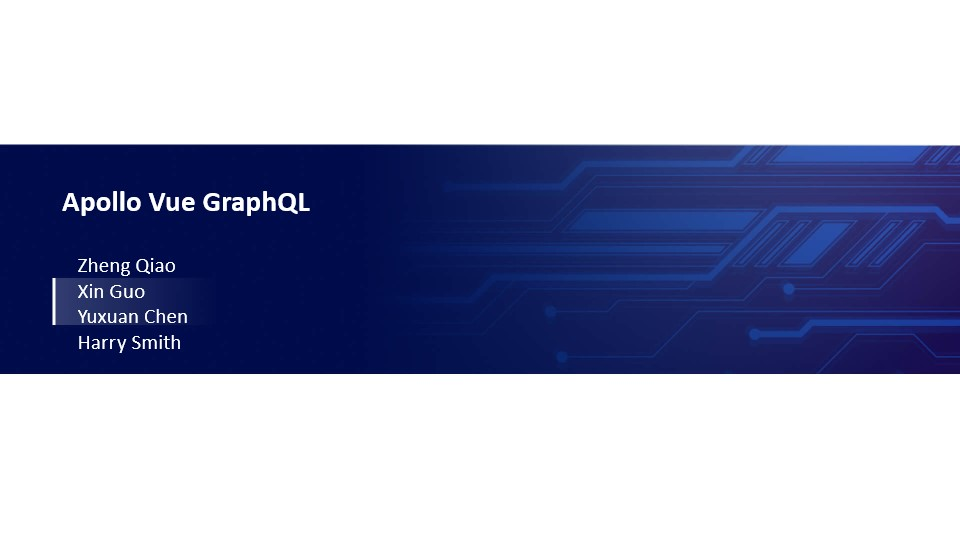

Next, our group will introduce the relationship between the three in detail and present our research through the following six aspects.

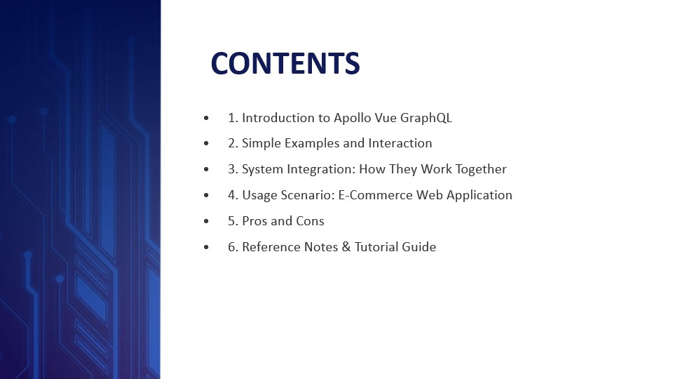

---------------------------------------------------------
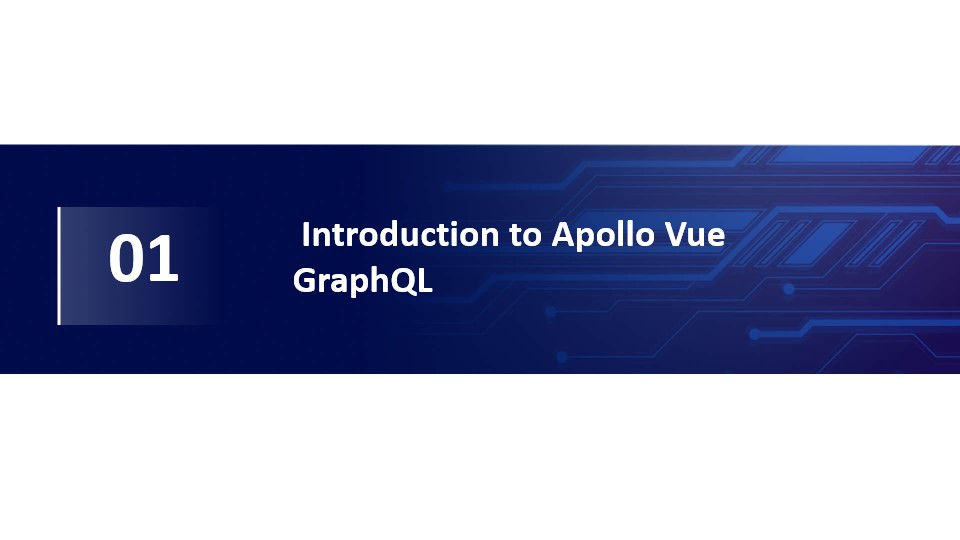

---------------------------------------------------------
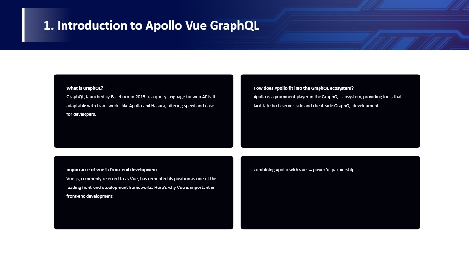

## introduction

Apollo, Vue.js, and GraphQL are three technologies that are often used together in modern web development. They play different roles in web applications, and their combination enables efficient data management, real-time updates, and interactive user interfaces.

# First, what is GraphQL? 

GraphQL is a query language and runtime environment for querying and manipulating APIs, introduced by Facebook in 2015. It is suitable for a variety of application scenarios, including mobile applications, web applications, microservice architectures, etc., and any situation where data communication with a server is required. Its core advantage is that the client can construct queries according to its own needs, thereby reducing unnecessary data transmission and improving efficiency. GraphQL is widely used in modern development, especially in combination with frameworks like Apollo and Hasura, providing developers with speed and convenience. 

# Secondly, how Apollo fits into the GraphQL ecosystem: 

Apollo Client is a very popular client library in the GraphQL ecosystem for integrating GraphQL with front-end applications (usually JavaScript or TypeScript). It helps front-end developers easily communicate with GraphQL servers, manage data, implement real-time data updates, and more. 

# Thirdly, The importance of Vue in front-end development: 

The importance of Vue.js (often referred to as Vue) in front-end development lies in its simplicity and ease of learning, progressive framework, component-based development, two-way data binding, virtual DOM, rich ecosystem, large community support, performance optimization and Cross-platform development capabilities. This allows developers to efficiently build modern web applications, making it very popular in the field of front-end development. 

# Finally, the combination of Apollo and Vue: 

The combination of Apollo and Vue.js allows front-end developers to easily interact with GraphQL servers, manage data, and achieve real-time data updates.

Therefore, I will introduce it to you in detail from four aspects: seamless integration, reactivity, component-driven, enhancement, and development experience.

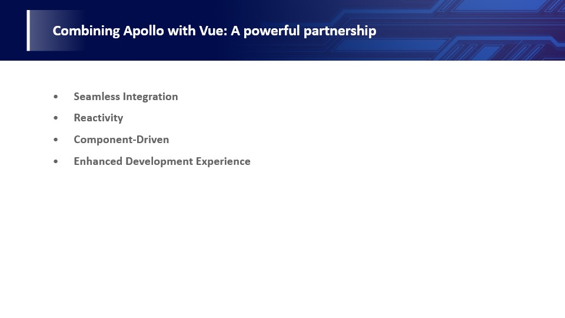

---------------------------------------------------------
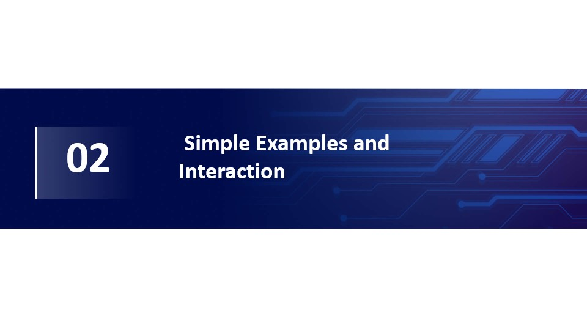

---------------------------------------------------------
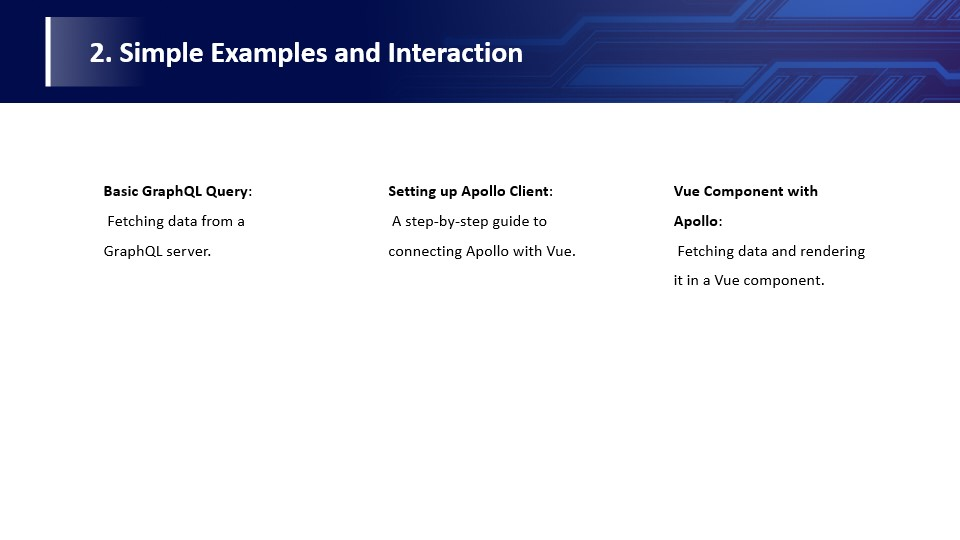

---------------------------------------------------------
In this part we will use examples to demonstrate basic GraphQL queries, setting up the Apollo client, and Vue components with Apollo.

First of all in this example we can see that this is a Vue.js component. It retrieves and displays role data from the GraphQL server and displays different content on the user interface based on loading status and error status.

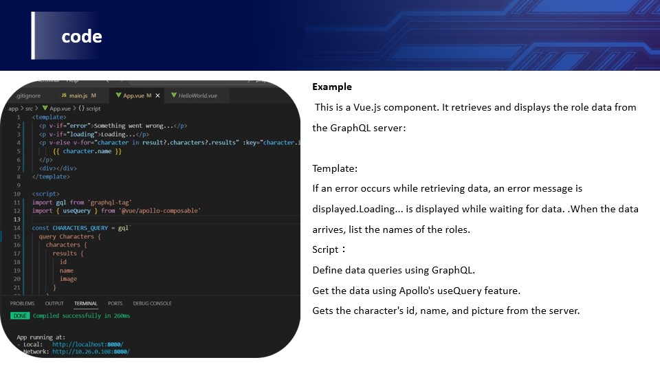

---------------------------------------------------------
This section is the template part: if an error occurs while retrieving data, an error message will be displayed. Loading... will be displayed while waiting for data. .When the data arrives, list the names of the roles. When the data arrives, list the names of the roles. 

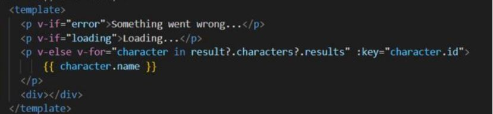

---------------------------------------------------------
We imported the required libraries and components in the script section and defined a GraphQL query named CHARACTERS_QUERY that requests role information. The setup function is used in Vue 3's Composition API to set up the component's reactive data. It uses the useQuery function to execute a CHARACTERS_QUERY query and returns the result, loading, and error variables.

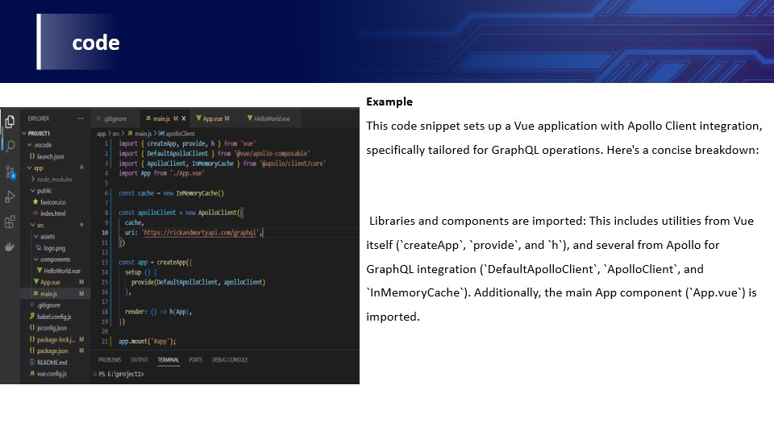

---------------------------------------------------------
Here we first import a series of modules and components related to Vue 3 and Apollo client.

---------------------------------------------------------
Then create an Apollo InMemoryCache cache instance named cache and an Apollo client instance 

---------------------------------------------------------
A Vue application instance (app) is created using the createApp function. 

---------------------------------------------------------
Finally, mount the Vue application on the DOM element with id 'app' using app.mount('#app') to launch the application.

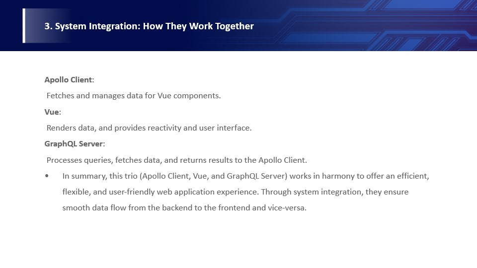

---------------------------------------------------------
The Apollo client is responsible for obtaining and managing data from Vue components. 

Vue is used to render this data and provide reactivity and user interface so that the data can be dynamically reflected on the user interface. 

The GraphQL server is responsible for processing queries, obtaining data from the data source, and returning the results to the Apollo client to meet the data needs of the Vue component. 

This layered architecture makes front-end development efficient and maintainable, allowing front-end developers to specify the data they need through GraphQL queries. This helps build responsive and efficient user interfaces.

---------------------------------------------------------

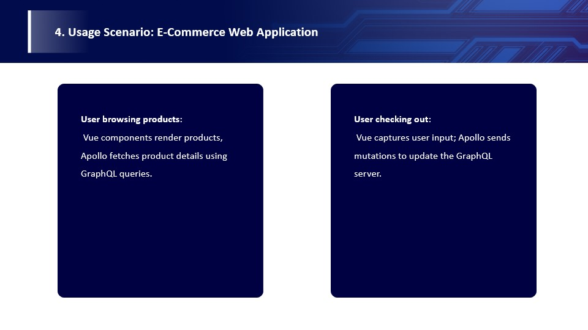

Of course, everything has its advantages and disadvantages, and the combination of Apollo, vue, and graphQL is no exception. 

---------------------------------------------------------
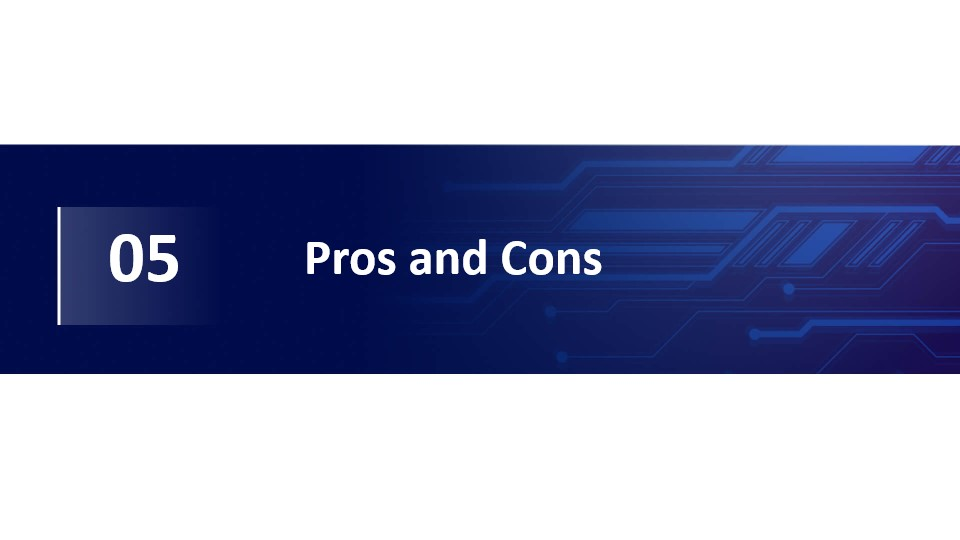

---------------------------------------------------------
first are the advantages.

the combination of the three has four main advantages: flexibility, reactivity, unified data flow, and strong community and ecosystem.

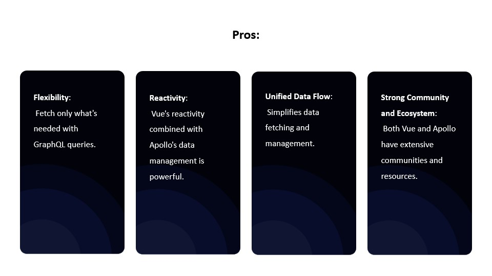

---------------------------------------------------------

# Next are the disadvantages:
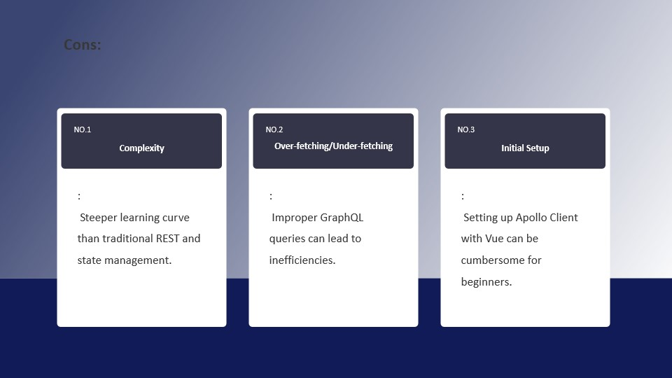

The first is complexity: a steeper learning curve than traditional REST and state management. 

The second is over-fetching/under-fetching: incorrect GraphQL queries can lead to inefficiencies. 

Finally, there’s the initial setup: For beginners, setting up the Apollo client with Vue can be cumbersome.

---------------------------------------------------------
# Finally, there are examples, reference notes, and tutorial guides that our group discussed and researched.

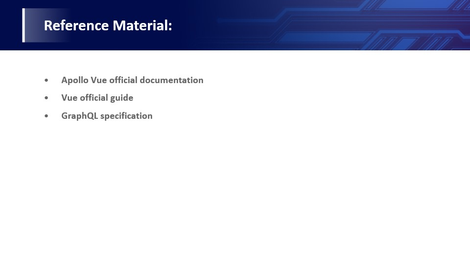

---------------------------------------------------------
This tutorial is available on the home page.

---------------------------------------------------------

